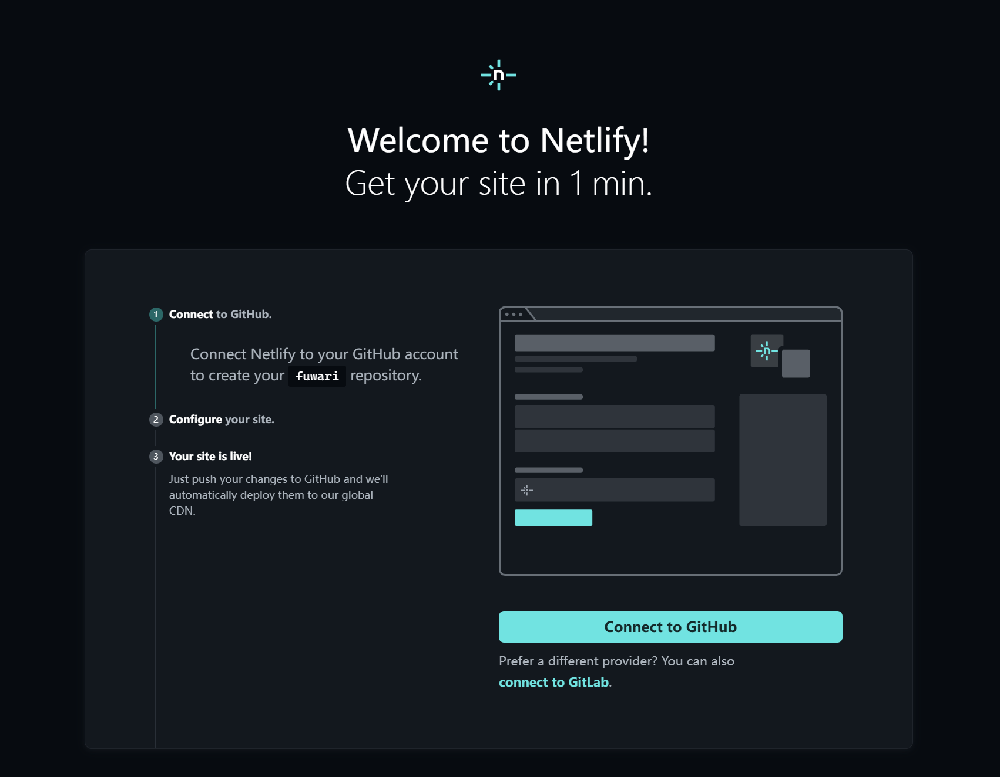
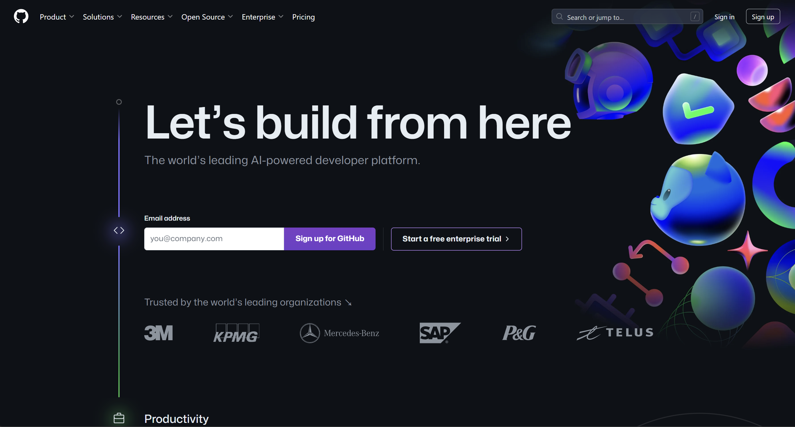
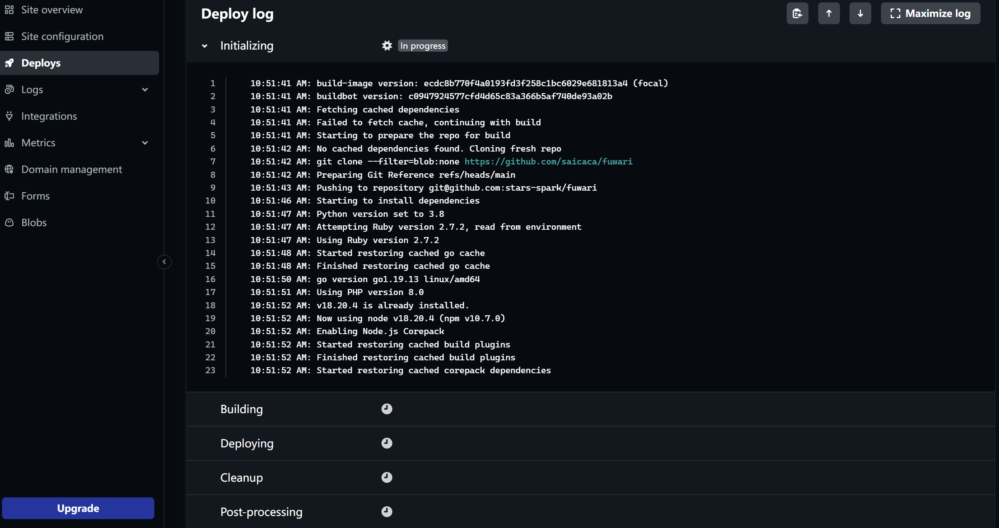
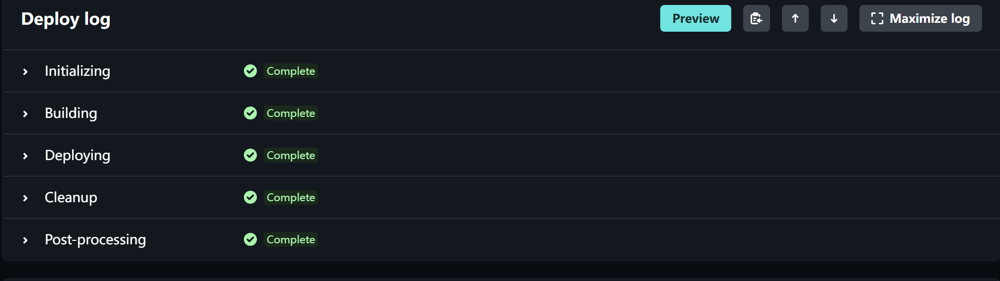

:::note[前言]
鉴于国内使用Astro框架的比较少，官方文档又有失时效性，遂特地抽空写一篇文章，希望能帮到屏幕前的你
:::

# 原理解释
:::tip
1. 静态网页源文件——Astro是静态网页的每个部分的零件
2. 源文件托管平台——你可以把Github当作一个云盘，可以存放你的网页 源文件（这样你就不用24小时都开着你的电脑以供访问了☺）
3. 远在他乡的网站服务器——Netlify公司负责读取你放在Github仓库里的网页源文件，并把你的网页部署在网络上
:::

此处有传送门
## Bilibili

<iframe src="//player.bilibili.com/player.html?isOutside=true&aid=729827798&bvid=BV1qD4y1z783&cid=811525188&p=1" scrolling="no" border="0" frameborder="no" framespacing="0" allowfullscreen="true"></iframe>

当然，他使用了Hexo代替了Astro，不过Astro的主题部署更方便些

# 你需要准备什么？

1. 科学上网
2. [Github](https://github.com/)账号
3. 能用的Gmail或者其他国外邮箱
4. [Node.js](https://nodejs.org/) - v18.17.1 或 v20.3.0 或更高版本。（不支持 v19）
5. 文本编辑器 - 推荐使用 VS Code

:::caution
只要你有打开的Netlify网页，你需要全程处在科学上网的状态，否则你的Netlify账号会被立马封禁！！！
:::

# 你将学会什么？
1. 部署简洁的静态网页作为博客网站
2. 学会域名的DNS转发解析
3. 学会使用Cloudflare的CDN加速服务
---
## 验证Node.js版本

    node -v

    // 输出示例
    v18.17.1
如果该命令返回的版本号高于 v18.17.1 或 v20.3.0（不包括任何 v19 版本），那么你就可以继续了！

如果命令返回错误信息如 Command 'node' not found，或者版本号低于所需版本，那么你需要安装兼容的 Node.js 版本。

### 代码编辑器
:::note[我们将用到...]
[Visual Studio Code](https://code.visualstudio.com/)(简称VScode)
:::
---
### 正文

1. 在[Astro官网](https://astro.build/themes/)中选择自己喜欢的主题
:::tip

在左侧Filter栏中，Categories勾选Blog，Pricing勾选free(有Doller的朋友可以不选)
:::

2. 找到喜欢的主题后点进去，在右侧这一栏中可以找到_Deploy to Netlify_的字样
:::warning
从此处-科学上网
:::

在点*Connect to Github*之前，我们打开[Github](https://github.com/)

填写自己的邮箱后点击 *Sign up for Github*

按照Github官方的引导，你已经成功拥有了一个GitHub账号。
让我们进入Github页面，点击 绿色的 *New* 创建一个新仓库

名字自己起就好啦，其他的设置我们可以不动它。
一切准备就绪，点击 *Create repository*

现在你已经成功拥有一个Github代码仓库用于储存你的博客网页源代码
---
### 再次回到Netlify的网页
可以 *Connect to Github* 了
加载后，点击对应的仓库，Netlify会选中此仓库，再部署博客网站
等待些许时间后点击 *Save&Deploy*
跳转至一下界面

如果你看到这四个 *Completed* 那就代表网站已经搭建成功了，现在你可以亲自看看自己的博客了，步骤如下：
1. 点击左侧栏中的Site overview
2. 找到 *https://*********.netlify.app* 并点击它

看到自己亲手部署的博客，证明你已经拥有了一个值得炫耀的网站