如果你想在Windows操作系统中运行C或c++程序，那么你需要有合适的编译器。

MinGW编译器是一种众所周知且广泛使用的软件，用于为C和C++编程语言安装[GCC](https://zh.wikipedia.org/wiki/GCC)和G++编译器。

但是许多开发人员在安装编译器时会遇到困难，所以我将在本文中通过屏幕截图向您展示安装编译器的所有步骤，以帮助您完成安装。

我将使用Windows 11，但同样的过程适用于所有其他Windows操作系统，除非你使用Windows XP(你需要更改Windows XP的一些步骤)。

---

### 安装MSYS2

1. 首先，我们需要从MSYS2下载一个可执行文件。登录MSYS2的官方网站:[https://www.msys2.org/](https://www.msys2.org/)。截至今天，网站看起来如下。

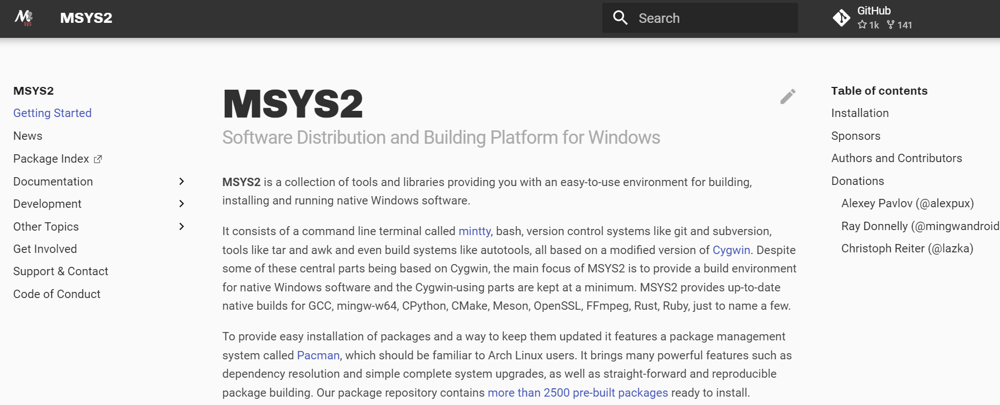

向下滚动一点，直到找到可执行文件(.exe)的下载按钮。

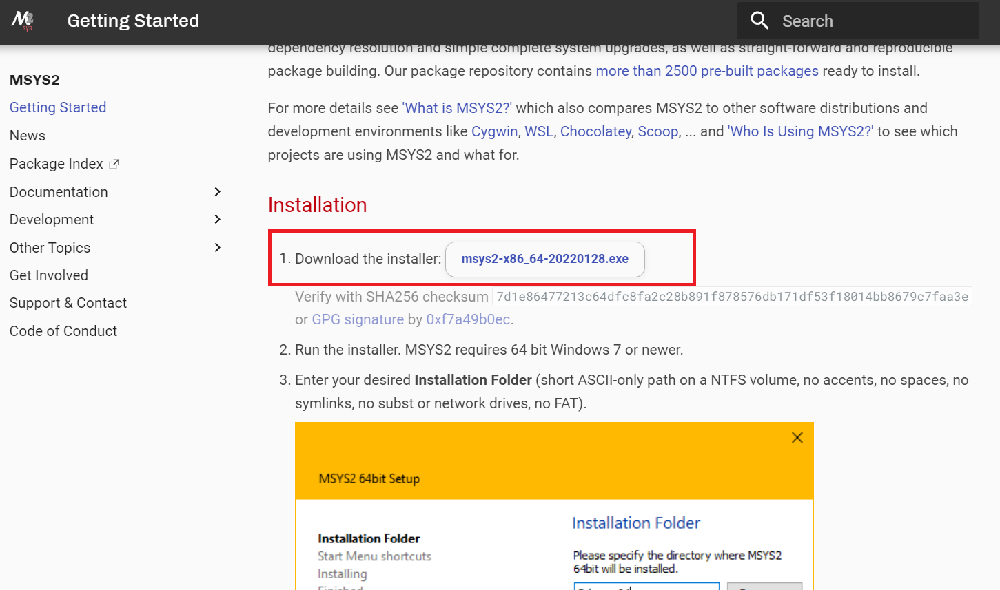

只需单击[msys2-x86_64-20240727.exe](https://github.com/msys2/msys2-installer/releases/download/2024-07-27/msys2-x86_64-20240727.exe)并将安装程序文件保存在您想要的任何位置。

稍等片刻待安装包下载完成

2. 双击它，一路next
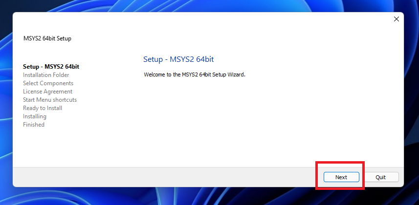
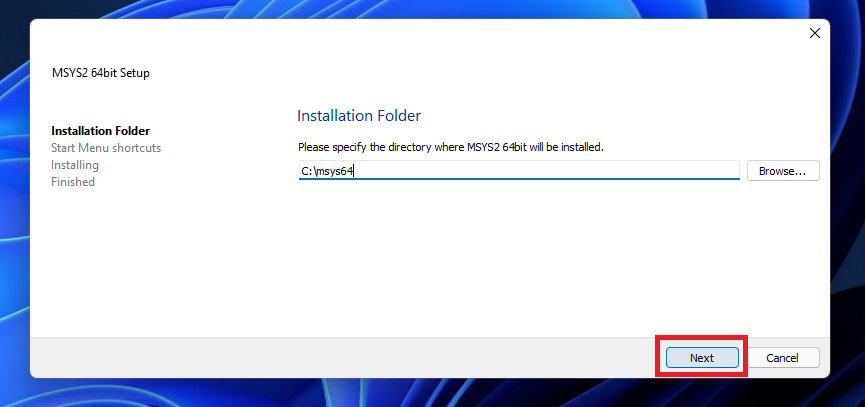
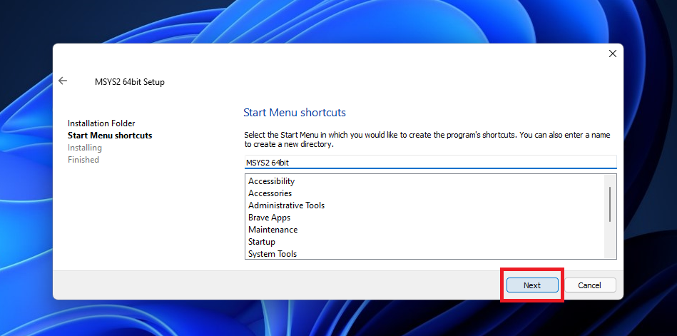
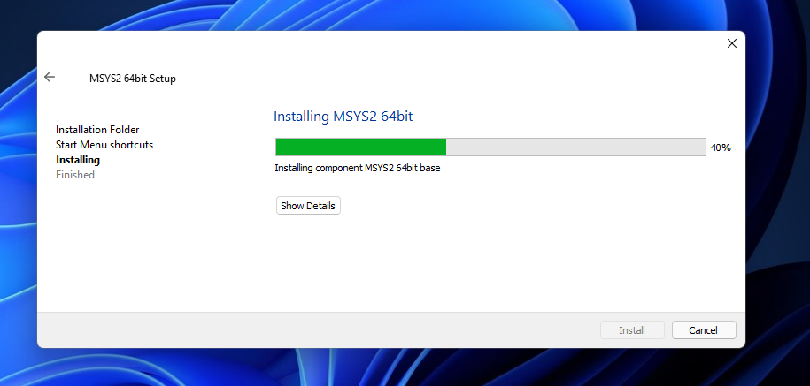
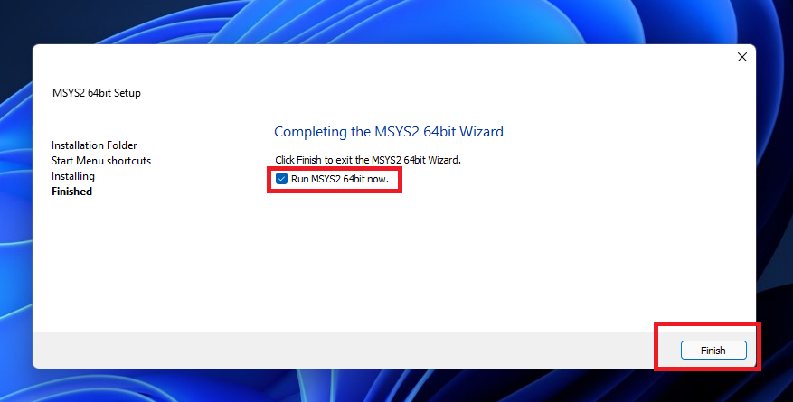

我更喜欢这样做，但如果你想以后再做剩下的任务，那么你需要自己从开始菜单中打开终端。

3. 配置MSYS2

在这种情况下，你必须点击 开始按钮>搜索MSYS2，点击如下图所示的终端:
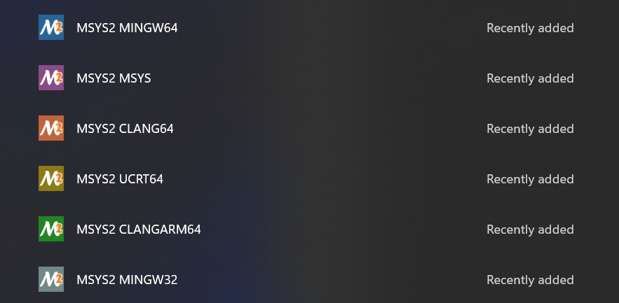

假设我们已经成功打开了MSYS2 MSYS终端。

使用 *pacman -Syu* 命令更新包数据库和基本包。
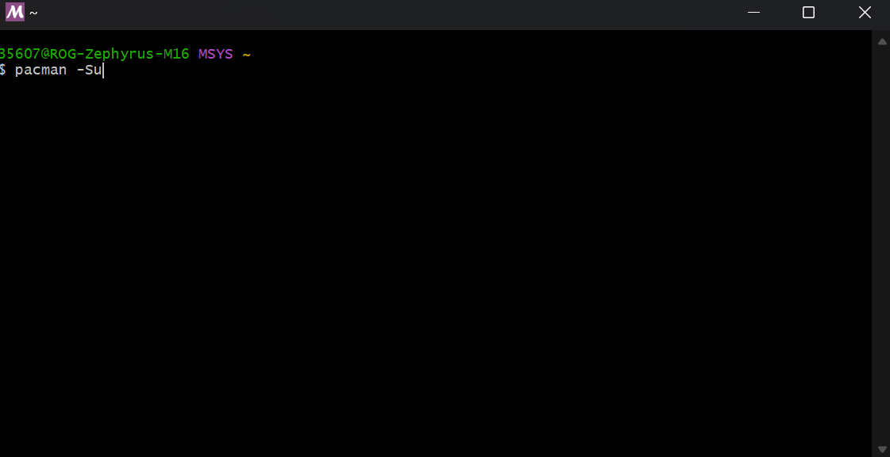
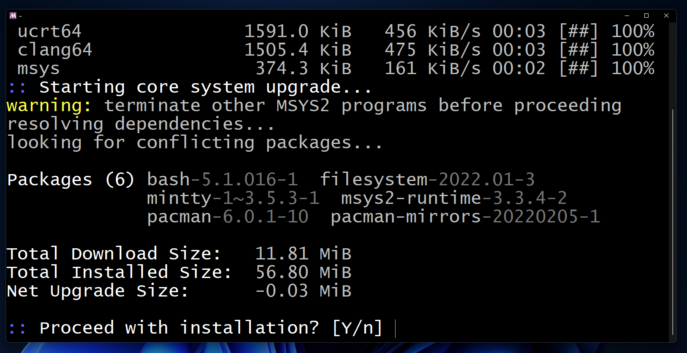
:::tip
如果您得到这种类型的安装提示，则输入y并按enter键。
:::
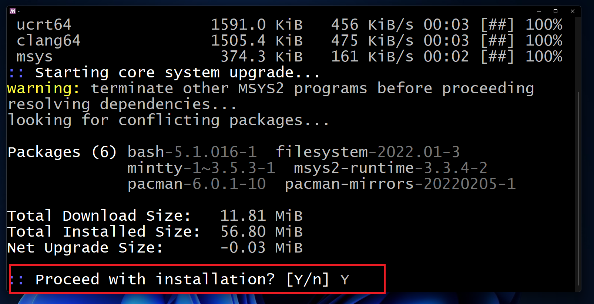
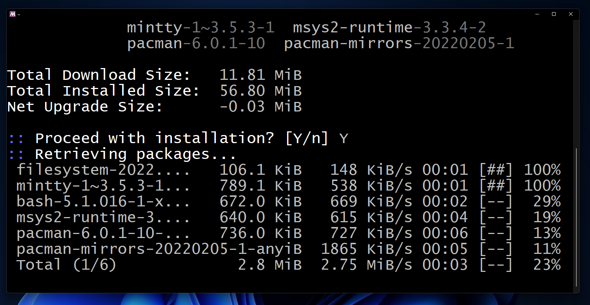

---

终端将自动关闭。我们必须手动打开终端并更新其余的软件包。

单击开始键（Windows键）

搜索名为“MSYS2 64bit”的文件夹。单击文件夹展开并获得终端。单击“MSYS2 MSYS”打开终端。

通过 *pacman -Su* 命令更新其余的包。
:::tip
如果终端提醒，您可能需要应用 *pacman -Sy* 命令。
:::

倘若出现询问，输入y并按Enter

当安装进程结束后，可以关闭该终端

### 安装GCC和G++编译器
如果您像我一样使用64位操作系统，那么我们需要使用MSYS2 MinGW x64终端。点击（蓝色）终端打开它。

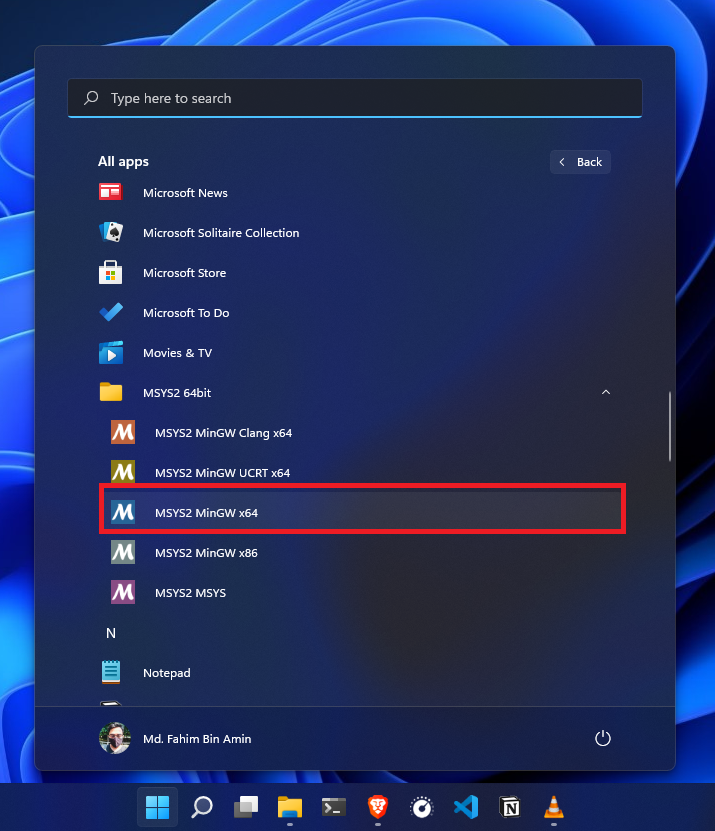
:::warning
但是，如果您使用的是32位操作系统，那么您必须使用MSYS2 MinGW x86 (灰色)终端。
:::

输入命令 *pacman -S mingw-w64-x86_64-gcc* 并回车 安装编译器。

不断地输入y并回车即可

现在已经完成了编译器的安装

### 如何安装调试器

如果您使用的是64位操作系统，那么您必须应用 *pacman -S mingw-w64-x86_64-gdb* 命令。
:::tip
如果您使用的是32位操作系统，那么必须在32位终端中应用   *pacman -S mingw-w64-i686-gdb* 命令。
:::

一路y并敲回车，然后give it some time.

结束进程后可关闭该终端

### 如何将编译器目录添加到环境变量中
1. 先打开文件管理器

我假设您已经像我一样将MSYS安装到默认目录中(64位)。
但如果您自定义了安装目录，那么您需要转到安装它的目录。

像下面这样复制该路径

2. 打开 *高级系统设置(View advanced system settings)* 。你可以用很多方法做到这一点。一个简单的方法就是点击开始按钮，然后像下面的截图一样搜索它。
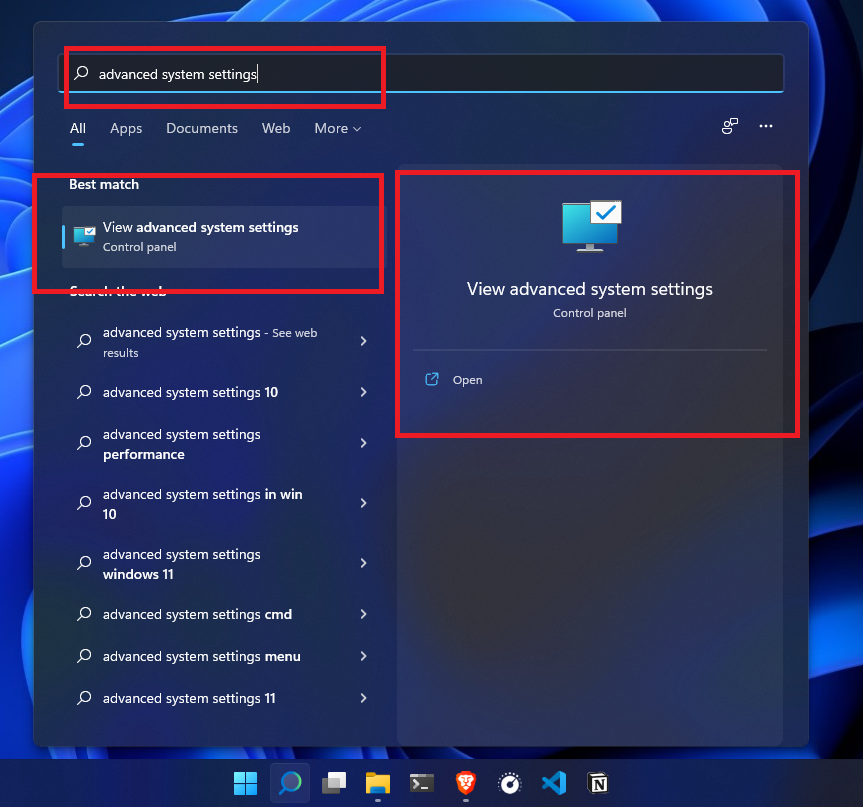

点击 *环境变量(Environment Variables...)*

点击 *路径(Path)* 如下图

弹出窗口

点击 *新建(New)*

在空栏中粘贴你所复制的路径 并回车
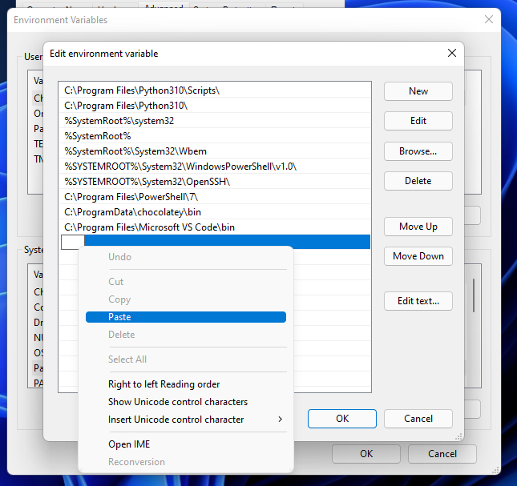

随后点击 *确定(OK)* 关闭各级窗口

### 检验你的安装成果
现在是时候检查我们是否已经成功安装了上述所有内容。

打开Terminal / PowerShell / CMD(任选其一)，依次执行以下命令

    gcc --version

    g++ --version

    gdb --version

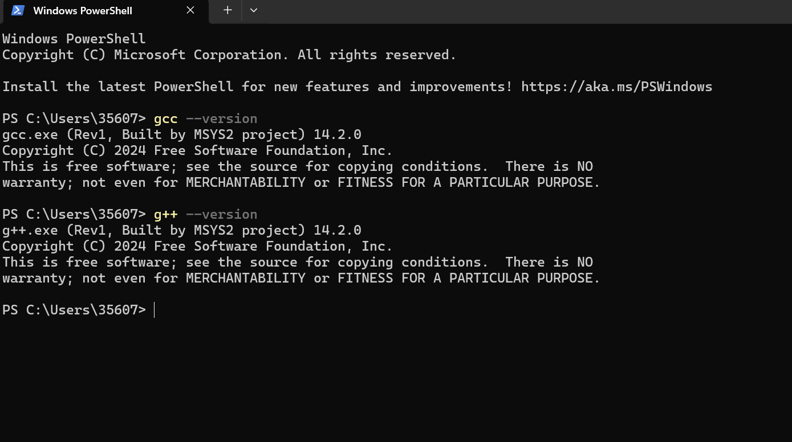

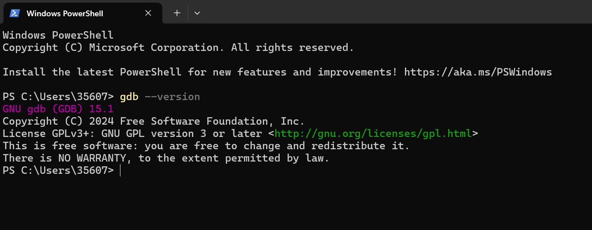
出现以上画面则表示你已经成功配置了C/C++编译环境